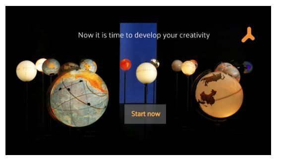

# MLMArchive Demo
## Overview
 

The Medialab Madrid Archive (MLM Archive) Demo is a digital educational resource to help students to develop study materials connected to transdisciplinary examples from the Medialab Madrid projects. It allows them to engage in an interactive way with academic heritage at the same time they are developing creative skills with a STEAM methodology.

 

## License

- **CC-BY-SA 4.0.** Read the [License.md](License.md) file to know the specifications about it.

## Acknowledgment

I would like to thank all the support received and the willingness of all the students, lecturers and researchers from the Complutense University of Madrid who have participated in this case study. I would like to thank especially the third-year students from the BA in Journalism at the Complutense University of Madrid for participating in the user testing and the senior lecturer Francisco Cabezuelo Lorenzo for letting me do it in his class

I would also like to thank all the researchers from the projects "Ciencia, arte, creatividad y sostenibilidad: el patrimonio científico-técnico de Medialab-Madrid al servicio de los estudiantes preuniversitarios" - FCT-21-16972 -  co-funded by the Spanish Foundation for Science and Technology (FECYT), the Complutense University of Madrid (UCM), the Polytechnic University of Madrid (UPM) and the University of Salamanca (USAL)  and "Científicos en las artes y artistas en la ciencia: hitos históricos en el Archivo de MediaLab Madrid a través de una propuesta expositiva y educativa" - FCT-22-17889 - co-funded by the Spanish Foundation for Science and Technology (FECYT), the Complutense University of Madrid (UCM), the Polytechnic University of Madrid (UPM), the University of Salamanca (USAL) and the Francisco de Vitoria University (UFV).

